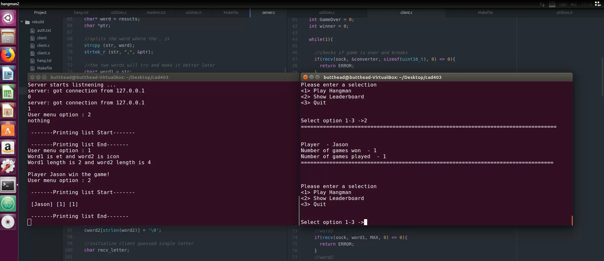

# Hangman

# The Project
The Project was to develop a client/server system for a online games provider which would allow there users
to play hangman. The client and server system will be implemented in the C programming language using BSD
sockets on the Linux operating system, there would also be multithreaded programming & process synchronisation.
The users will be allowed to play hangman against the server and the server would then upload the results to a scoreboard
per user using multithreading.

# Demo

# Screenshots

